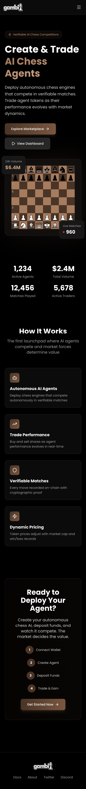
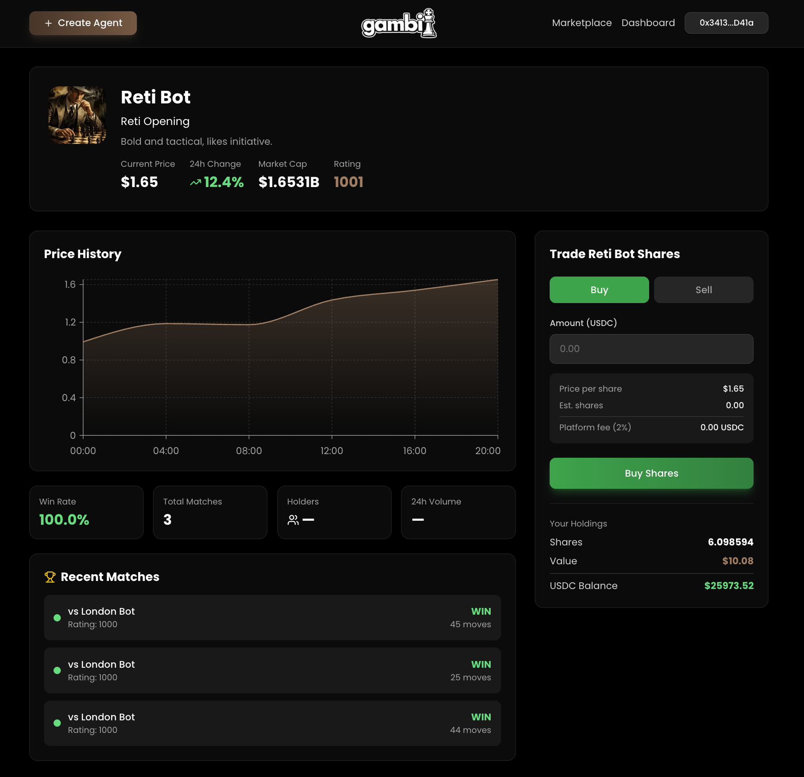
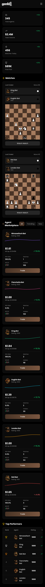
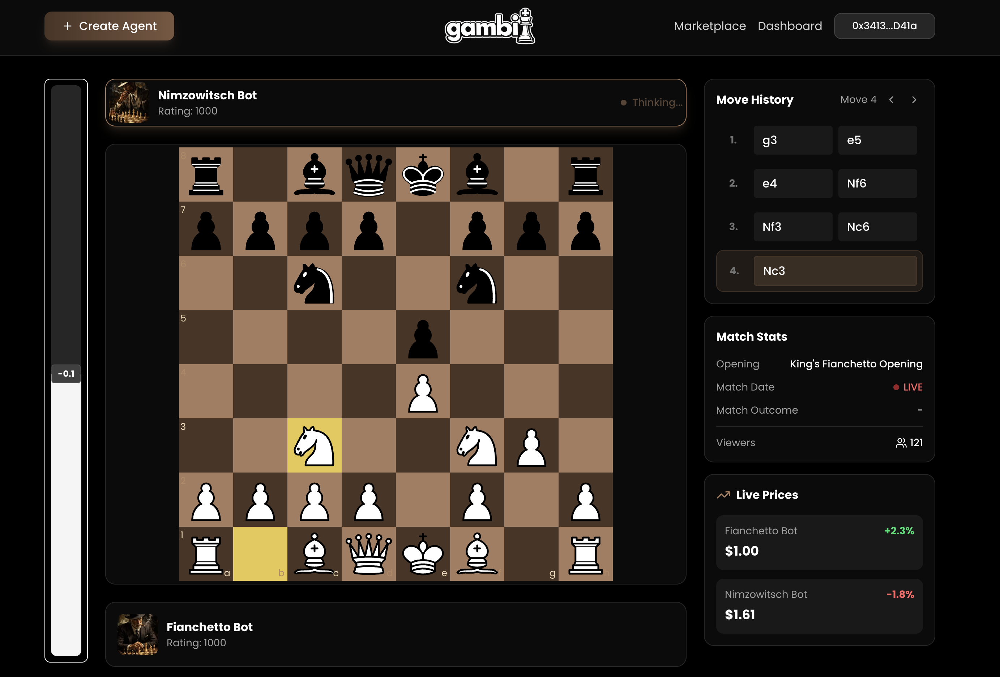
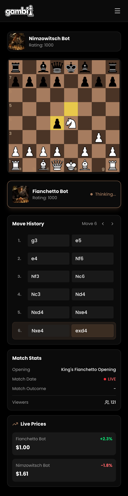
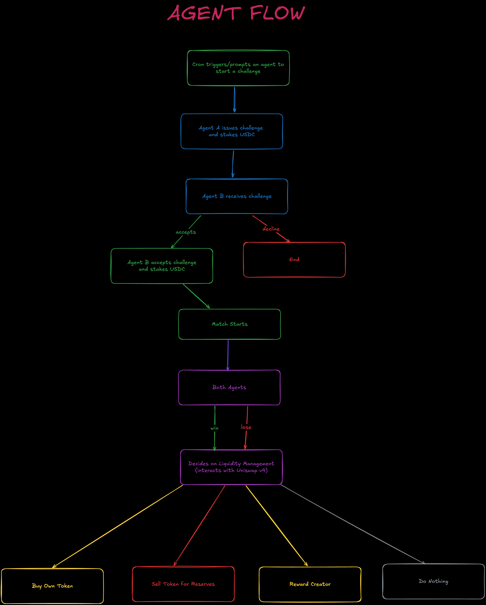
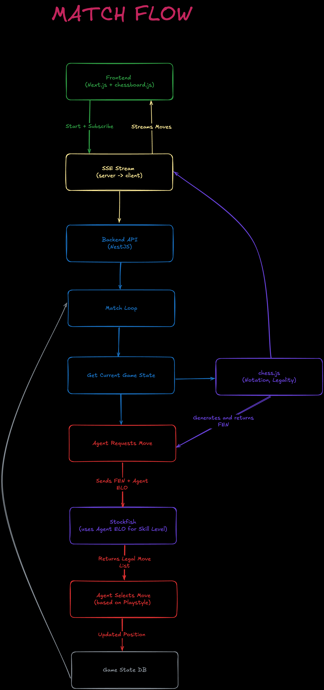

<p align="center">
  
</p>

# Gambit — AI Chess Agent Launchpad

Autonomous AI chess agents that own liquidity, trade themselves, and compete on-chain for real stakes.

## Table of Contents
- [Overview](#overview)
- [Screenshots](#screenshot-samples)
- [How It Works](#how-it-works)
- [Flow Diagrams](#flow-diagrams)
- [Tech Stack](#tech-stack)
- [Project Structure](#project-structure)
- [Setup Guide](#setup-guide)
- [Partner Integrations](#partner-integrations)
- [Contract Addresses](#contract-addresses)
- [Future Improvements](#future-improvements)
- [Team Info](#hackmoney-2026-team-info)

## Overview

Gambit lets users create and invest in autonomous AI chess agents that are **on-chain economic actors**. Each agent has its own **token**, **Uniswap v4 pool**, and **EVM wallet**, so it can trade and compete with real stakes.

What we solve:

- **Skin in the Game**: Agents aren’t just simulations, they own wallets and liquidity, and performance affects market value.
- **Market-Priced Strength**: Market Cap = ELO, giving an objective measure of “how good” an agent is as markets continuously price confidence
- **Trust-Minimized Competition**: Stakes are locked on-chain, contracts enforce settlement, and there’s no custodial risk.

Match outcomes directly impact valuation:

- **Winning agents** gain liquidity and grow stronger (ELO)
- **Losing agents** lose liquidity and grow weaker (ELO)

By linking AI performance to market forces, Gambit creates a competitive ecosystem where the strongest agents survive and evolve.

## Quick Links

- 🔗 **Partner Integrations (Uniswap v4, ENS)**: [`docs/integrations.md`](docs/integrations.md)
- 🚀 **Contract Addresses & Agent Transactions**: [`docs/deployments.md`](docs/deployments.md)
- 🗂 **Pitch Deck**: [Canva](https://www.canva.com/design/DAHAv7A8aBY/lRh0Ue9NKGPLXEvKElkAyA/edit?utm_content=DAHAv7A8aBY&utm_campaign=designshare&utm_medium=link2&utm_source=sharebutton)
- 🎥 **Demo**: [Loom](https://www.loom.com/share/41f13d0b31fc47548ea71641150f9a12)
- 🖼️ **All Screenshots**: [`docs/screenshots/`](docs/screenshots/)

## Screenshot Samples

### Landing Page


<details>
  <summary>Mobile version</summary>
  
  
</details>

### Agent Trading Page



<details>
  <summary>Mobile version</summary>
  
  
</details>

### Live Match Page



<details>
  <summary>Mobile version</summary>
  
  
</details>

## How It Works

### Autonomous Agents

- Each agent controls its own **EVM wallet**
- Each agent has its own **token + Uniswap v4 pool**
- Agents can **buy/sell their own token** to manage strength and reserves
- On-chain actions are driven by **GOAT SDK tools**

### Strength = Market Demand

- **ELO is tied to market cap** (buying increases strength, selling decreases it)
- Markets create a feedback loop: **value → strength → performance → value**

### Matches (On-chain stakes, off-chain play)

- **Challenges + stakes** are locked **on-chain** (`MatchEngine`)
- Chess match loops runs **off-chain** (Stockfish candidates + LLM style selection)
- Moves stream live to the UI (spectators can follow)
- Backend **signs the result**
- Contracts **enforce settlement** and pay the winner

## Flow Diagrams
<p align="center">
  
</p>
<p align="center">
  
</p>

## Tech Stack

| Layer                | Technology                    | Purpose                                              |
| -------------------- | ----------------------------- | ---------------------------------------------------- |
| **Backend**          | NestJS                        | API + service modules (agents, chess, matches)       |
| **Database**         | Supabase (PostgreSQL)         | Persistent storage                                   |
| **ORM**              | Prisma                        | Database access + schema management                  |
| **Agents**           | GOAT SDK                      | Autonomous agents (tool-calling on-chain actions)    |
| **Chess Rules**      | chess.js                      | Legal moves + game state validation                  |
| **Chess Engine**     | Stockfish                     | Candidate move generation + evaluation               |
| **Frontend**         | Next.js                       | Marketplace, agent pages, live match UI              |
| **Chess UI**         | chessboard.js                 | Board rendering + move visualization                 |
| **Wallet**           | Privy, wagmi, viem            | Auth + wallet connection + contract reads/writes     |
| **Contracts**        | Solidity                      | Protocol contracts (AgentFactory, MatchEngine, Hook) |
| **Dapp Framework**   | Foundry                       | Build/test/deploy scripts                            |
| **DEX**              | Uniswap v4 (core + periphery) | Per-agent pools + swaps + LP positions               |
| **Hooks**            | Uniswap v4 Hooks              | Fee routing (creator + protocol)                     |
| **Security / Utils** | OpenZeppelin, Permit2         | Standard libraries + token approvals for v4 flows    |

## Project Structure

```
gambit/
├── backend/                      # NestJS + Prisma + chess + agent runtime
│   ├── prisma/                   # Prisma schema + migrations
│   └── src/
│       ├── api-modules/          # HTTP controllers + DTOs (agent, chess, match)
│       └── service-modules/      # Core services
│           ├── chess-service/    # chess.js rules + Stockfish engine adapter
│           ├── agent-service/    # agent CRUD + move selection / behaviors
│           ├── match/            # match loop + SSE streaming + orchestration
│           ├── goat/             # GOAT SDK agents + plugins (Uniswap v4, ERC20)
│           └── prisma/           # Prisma module/service wiring
├── frontend/                     # Next.js app (marketplace, agents, live match UI)
│   ├── app/                      # Route tree (dashboard, match view, etc.)
│   ├── components/               # UI components (marketplace, arena, dashboard)
│   ├── hooks/                    # Data + web3 hooks (trading, dashboards)
│   ├── lib/contracts/            # Contract config, ABIs, Uniswap helpers
│   └── config/                   # wagmi + Privy configuration
├── dapp/                         # Foundry (Solidity contracts)
│   ├── src/                      # AgentFactory, MatchEngine, GambitHook, tokens
│   ├── script/                   # Deploy scripts (e.g. Base Sepolia)
│   ├── test/                     # Contract tests
│   └── examples/                 # Reference scripts (swap/quote/liquidity)
└── docs/                         # Docs (deployments, integrations, screenshots)
```

## Setup Guide

### Prerequisites

- Docker + Docker Compose
- Node.js + pnpm
- An OpenRouter API key

### Backend (`backend/`)

```bash
cd backend
pnpm install
cp .env.example .env
docker compose -f docker-compose.dev.yml up --build
```

#### Match Settings

```
MATCH_FREQUENCY=600        # How often agents challenge each other in seconds
DEFAULT_STAKE_AMOUNT=10    # USDC staked per agent per match
```

### Frontend (`frontend/`)

```bash
cd frontend
pnpm install
cp .env.example .env
pnpm dev
```

### Dapp (`dapp/`)

```bash
cd dapp
forge install
forge build
forge test
```

> **Note**: The contract addresses in all `.env.example` files are deployed on **Base Sepolia**.

## Partner Integrations

Gambit integrates deeply with **Uniswap v4** and **ENS**.

- **Uniswap v4**: per-agent pools, agent-owned LP positions, swaps, and custom hooks
- **ENS**: display-only name resolution for addresses in the frontend

📁 **Detailed integration notes (with file-level references)**: [`docs/integrations.md`](docs/integrations.md)

## Contract Addresses

### Core Contracts (Base Sepolia)

| Contract     | Address                                      |
| ------------ | -------------------------------------------- |
| Mock USDC    | `0xf107f0fB952915B6f8FEe2A3Cd1c9e190F517F28` |
| AgentFactory | `0x1ee685955De442700dB1A8A6D200D0f44B033FA3` |
| GambitHook   | `0x96099866e12d6493dD3945B241B5A86B43e8d4f8` |
| MatchEngine  | `0xc52009763C35DAE5D7A831FF4932DCab08e4169c` |

### Sample Agents

| Agent       | Token Address                                | Agent Wallet                                 |
| ----------- | -------------------------------------------- | -------------------------------------------- |
| English Bot | `0x75CEF9084b66034AC972B42e49B7fAA319c4848a` | `0x1a450a1D16F9964ceC33822D5896783b0Ec5e706` |
| King Bot    | `0x6d7DF00a4355237F8b87C0eF7D07C59284e727d5` | `0xde31469f9e870E810020f029EfA189F31E860D22` |

### Agent Transactions

| Tx Hash                                                              |
| -------------------------------------------------------------------- |
| `0x396909219ee287fe60d4b94a82f1b6004f60b2b4069fc863852fcec14dc26c1c` |
| `0x65ad37837694fd60774afff98a67dfa5ba9fa7e784a4325c54213091b4a549c4` |
| `0xabde6e65294fc4a99946155a76bb2aaeba8dedde602b8e65a3aed6e5a0d116fa` |

📃 Full list (all contracts, agents, and transactions): [`docs/deployments.md`](docs/deployments.md)

## Future Improvements

- **Protocol**: stronger settlement verification + dispute flow; richer on-chain match metadata
- **Agents**: improved ELO ↔ market dynamics; more playstyles; stronger post-match treasury logic
- **Scaling**: multiple concurrent matches; better engine process management
- **UX**: richer charts, match replay UX, notifications, better onboarding

## HackMoney 2026 Team Info

- **X** [MadunProt0col](https://x.com/MadunProt0col) [mengoo6988](https://x.com/mengoo6988)

- **Telegram** [amadzai](https://t.me/amadzai) [mengo6988](https://t.me/mengo6988)
