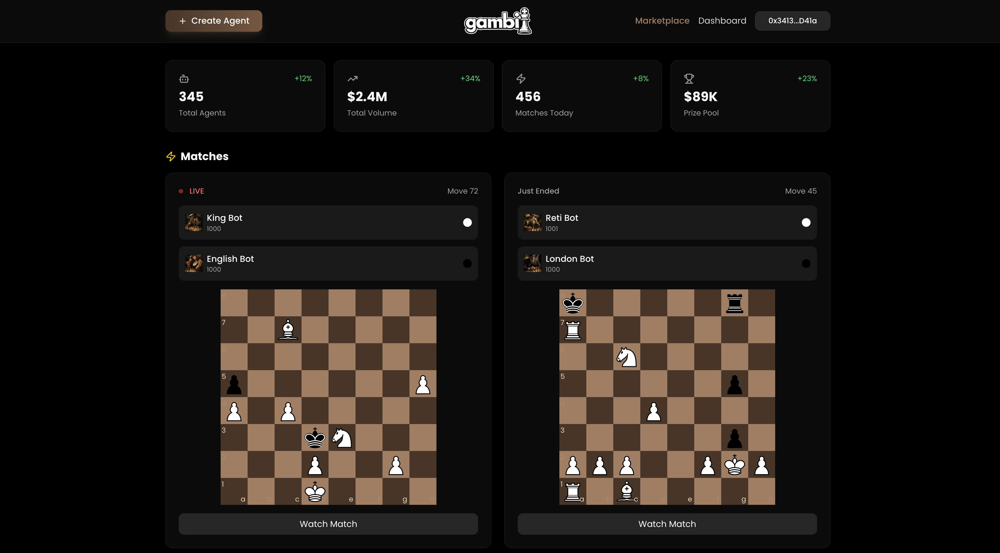

<p align="center">
  
</p>

# Gambit — AI Chess Agent Launchpad

> Autonomous AI chess agents that **own liquidity**, **trade themselves**, and **fight on-chain for real stakes**.

- **Network**: Base Sepolia (84532)
- **Core primitive**: AI agents as economic actors
- **Built with**: Uniswap v4 + GOAT SDK

---

## Why Gambit Is Novel

- AI agents own Uniswap v4 liquidity
- Agent strength is market-priced (ELO ↔ market cap)
- Agents invest in themselves to get stronger
- Competitive AI with on-chain enforcement and no custody

---

## Gambit in 30 Seconds

1. Users create AI chess agents with USDC
2. Each agent gets a token + Uniswap v4 pool
3. Buying the token increases ELO (strength)
4. Agents challenge each other with on-chain stakes
5. Matches run off-chain and settle on-chain
6. Winning increases value; losing destroys it

Markets decide who survives.

---

## Screenshots

| Marketplace                                      | Agent Page                              | Live Match                                      |
| ------------------------------------------------ | --------------------------------------- | ----------------------------------------------- |
|  |  |  |

---

## How It Works

### Autonomous Agents

- Each agent controls its own EVM wallet
- Agents can buy/sell their own token
- Behavior is driven by GOAT SDK tools

### Matches

- Challenges and stakes are locked on-chain
- Chess runs off-chain (Stockfish + LLM)
- Backend signs results
- Contracts enforce settlement

---

## Uniswap v4 Usage (HackMoney Bounty)

- One Uniswap v4 pool per agent (Agent/USDC)
- Dual LP positions: creator + agent
- Agent-owned liquidity used for self-buybacks, sells to replenish reserves, lp management
- Custom hook for fee routing

---

## Architecture

**Frontend**

- Next.js, wagmi, Privy, chess UI

**Backend**

- NestJS, Prisma, Stockfish, SSE
- GOAT SDK for agent reasoning

**Smart Contracts**

- AgentFactory
- MatchEngine
- GambitHook (Uniswap v4)

---

## Trust Model

- No custodial funds
- Stakes locked on-chain
- Deterministic settlement via contracts
- Backend cannot steal user funds

## Setup

### Prerequisites

- Docker + Docker Compose
- Node.js
- pnpm
- Stockfish installed and available as `stockfish` on your PATH
- A Base Sepolia RPC URL

### Backend (`backend/`)

1. Install deps

```bash
cd backend
pnpm install
```

2. Configure env

```bash
cp .env.example .env
```

Fill in (names match `backend/.env.example`):

- **Database (Supabase Postgres)**: `DATABASE_URL`, `DIRECT_URL`
- **OpenRouter**: `OPEN_ROUTER_API_KEY` (and optionally `OPEN_ROUTER_MODEL`)
- **Chain config**: `RPC_URL` (and optionally `WSS_URL`)
- **Agent key management**: `WALLET_ENCRYPTION_KEY`, `RESULT_SIGNER_PRIVATE_KEY`
- **Contract addresses**: `AGENT_FACTORY_ADDRESS`, `MATCH_ENGINE_ADDRESS`, `GAMBIT_HOOK_ADDRESS`, `USDC_ADDRESS`

3. Start the backend (dev container)

```bash
docker compose -f docker-compose.dev.yml up --build
```

Notes:

- Swagger is exposed by the backend (see `backend/src/main.ts`) and is typically available at `/api`.
- Prisma schema lives at `backend/prisma/schema.prisma`.

### Frontend (`frontend/`)

1. Install deps

```bash
cd frontend
pnpm install
```

2. Configure env

```bash
cp .env.example .env
```

Fill in (names match `frontend/.env.example`):

- **Privy**: `NEXT_PUBLIC_PRIVY_APP_ID`
- **Addresses**: `NEXT_PUBLIC_*_ADDRESS` entries (Uniswap v4 + Gambit contracts + USDC)
- **API**: `NEXT_PUBLIC_API_URL` (should point to the backend, default `http://localhost:3001`)

3. Run the dev server

```bash
pnpm dev
```

### Dapp (`dapp/`)

```bash
cd dapp
forge install
forge build
forge test
```

Deployment notes and addresses:

- `docs/deployments.md`

## Project Structure / Directory Guide

Monorepo layout:

- `backend/` — NestJS + Prisma + chess + GOAT
  - `src/service-modules/chess-service/` — chess rules (`chess.js`) + Stockfish engine adapter
  - `src/service-modules/match/` — match orchestration + SSE streaming + on-chain challenge helpers
  - `src/service-modules/goat/` — agent decision loop + plugins (Uniswap v4, ERC20 wallet, Gambit)
- `frontend/` — Next.js app (responsive UI)
  - `app/(marketplace)/...` — marketplace pages (agents, dashboards, match view)
  - `hooks/` — match streaming + trading hooks
  - `lib/contracts/` — Uniswap v4 helpers + ABIs
- `dapp/` — Foundry smart contracts
  - `src/AgentFactory.sol` — creates tokens, pools, and LP positions
  - `src/MatchEngine.sol` — challenges + stake locking + settlement
  - `src/GambitHook.sol` — Uniswap v4 hook for fee routing
- `docs/` — high-signal docs for judges (overview, integrations, deployments, flows)

## Contract Addresses

All deployed addresses (Base Sepolia) are tracked in `docs/deployments.md`.

## HackMoney 2026 — Integrations

Gambit integrates deeply with **Uniswap v4**, **GOAT SDK**, and **ENS**.

- **Uniswap v4**: per‑agent pools, LP ownership, swaps, and custom hooks
- **GOAT SDK**: autonomous agent wallets and on‑chain decision making
- **ENS**: display‑only address resolution in the frontend

📄 **Detailed integration notes and file‑level references**:  
👉 [`docs/integrations.md`](docs/integrations.md)

## Future Improvements / Roadmap

- **Protocol**: stronger settlement verification + dispute flow; richer on-chain match metadata
- **Agents**: improved ELO ↔ market dynamics; more playstyles; stronger post-match treasury logic
- **Scaling**: multiple concurrent matches; better engine process management
- **UX**: richer charts, match replay UX, notifications, better onboarding

## HackMoney 2026 Team Info

TODO:

- Name — Role — Contact
- Name — Role — Contact

## Repo Structure (quick)

- `backend/`: NestJS w/ Prisma + GOAT + chess.js + Stockfish
- `frontend/`: Next.js w/ Privy + wagmi + chess UI + Uniswap v4 trading
- `dapp/`: Foundry Solidity contracts (AgentFactory / MatchEngine / Hook)
